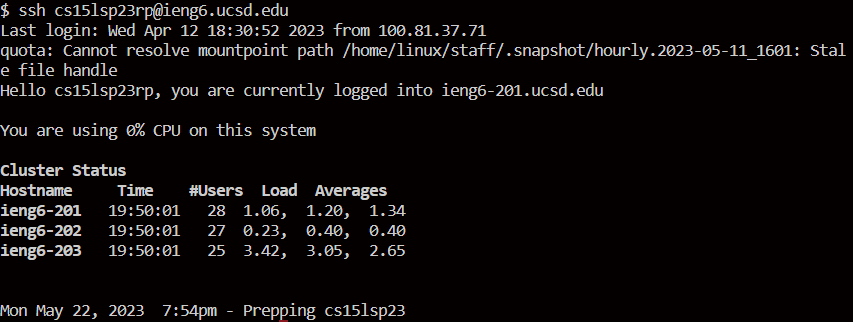
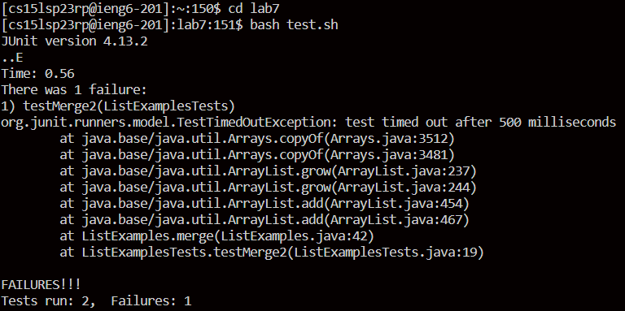
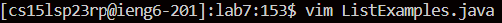
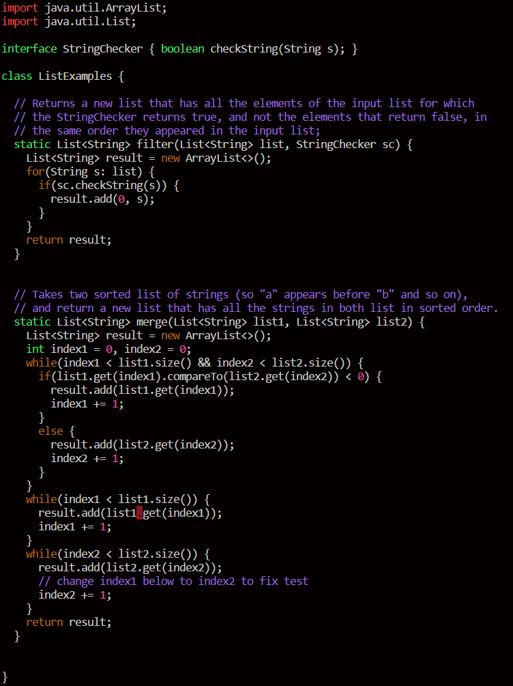
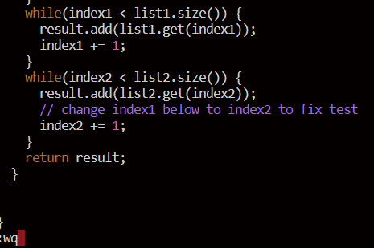
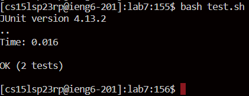

Commands will styled as inline code, whilst the keys pressed will be shown in angled brackets.

* `ssh cs15lsp23rp@ieng6.ucsd.edu` -> `<enter>`

* `git clone` -> `Ctrl-V` -> ` git clone https://github.com/nullSpac3/lab7.git` -> `<enter>`

* `cd lab7` -> `<enter>` -> `bash test.sh`

* `vim` -> `<space>` -> `L` -> `<tab>` -> `vim ListExamples` -> `vim ListExamples.java`

* `<left>` -> `<x>` -> `<a>` -> `<2>` -> `<esc>` -> `:wq`

* `<up>` -> `<enter>` -> `\\ runs "bash test.sh"`

* `git commit -m "fixed"`
