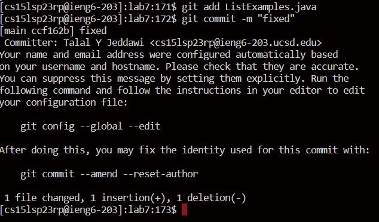

Commands will styled as inline code, whilst the keys pressed will be shown in angled brackets.

* `ssh cs15lsp23rp@ieng6.ucsd.edu` -> `<enter>`
    * Logs onto a remote server `ieng6`

* `git clone` -> `Ctrl-V` -> `git clone https://github.com/nullSpac3/lab7.git` -> `<enter>`
     * Clones the lab7 repository from my github account

* `cd lab7` -> `<enter>` -> `bash test.sh` -> `<enter>`
     * Switches to lab7 directory, then runs the bash script file `test.sh`

* `vim` -> `<space>` -> `L` -> `<tab>` -> `vim ListExamples` -> `vim ListExamples.java` -> `<enter>`
     * Opens `ListExamples.java` in a vim editor in the bash terminal
     

* `<left>` -> `<x>` -> `<a>` -> `<2>` -> `<esc>` -> `:wq` -> `<enter>`
     * Edits file as required, then saves and closes the vim editor

* `<up>` -> `<enter>` -> `\\ runs "bash test.sh"` 
     * 

* `git commit -m "fixed"` -> `<enter>`

I couldn't get the previous part to work. I referred to lecture but I still don't understand what is wrong.
